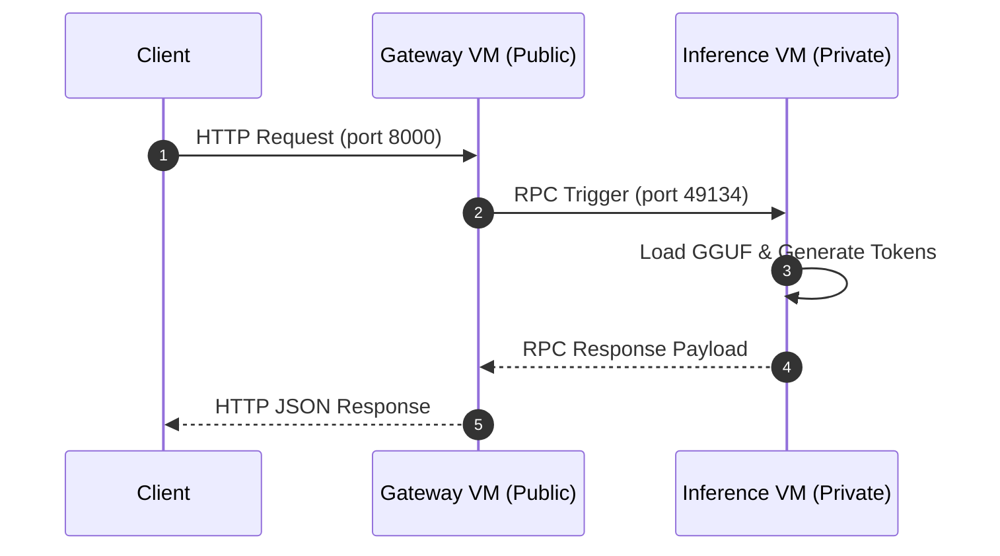

# Engineering Journal: Building a Distributed Multi-VM Inference Mesh on AWS

This document chronicles the architecture, deployment decisions, and debugging journey for setting up a secure, multi-VM distributed inference system on AWS. 

---

## System Architecture & Topology

The system separates the public API Gateway from the underlying machine learning worker to guarantee security and resource isolation.

```text
                      +---------------------------------------+
                      |               Custom VPC              |
                      |              (10.0.0.0/16)            |
                      +---------------------------------------+
                                          |
                     +--------------------+--------------------+
                     |                                         |
         +-----------------------+                 +-----------------------+
         |     Public Subnet     |                 |     Private Subnet    |
         |     (10.0.1.0/24)     |                 |     (10.0.2.0/24)     |
         +-----------------------+                 +-----------------------+
         |                       |                 |                       |
         |  [Internet Gateway]   |                 |    [NAT Gateway]      |
         |           |           |                 |          ^            |
         |           v           |                 |          |            |
         |    API Gateway VM     |                 |    Inference VM       |
         |    (10.0.1.155)       |                 |     (10.0.2.10)       |
         |   - iii-engine (49134)| ===(Private)=== | - Python Worker       |
         |   - caller-worker(TS) |                 |                       |
         |   - HTTP Port (8000)  |                 |                       |
         +-----------------------+                 +-----------------------+
```

### High-Level Request Pipeline

1. **Ingress:** The client triggers a `POST` request to `http://<API_GATEWAY_IP>:8000/v1/chat/completions`.
2. **Orchestration:** The gateway VM runs the Rust-based `iii-engine` which acts as the central RPC hub, routing requests to the TS-based `caller-worker`.
3. **RPC Dispatch:** The `caller-worker` dispatches the request to the `inference::run_inference` function registered by the remote Python worker.
4. **Execution:** The Python worker running inside the private subnet generates the tokens using Gemma-3 (270M parameters) on CPU and returns the response.



---

## Infrastructure Provisioning (Terraform)

All networking, gateways, and instances are configured via Terraform under `/terraform`.

### Core Provisioning Workflow

* **Initialization:** `terraform init` to download the AWS provider.
* **Validation:** `terraform validate` to verify the code blocks.
* **Deployment:** `terraform apply` to create the VPC, subnets, NAT gateway, route tables, and instances.

```text
Output:
gateway_public_ip = "13.201.127.202"
```

---

## Step-by-Step Deployment Configuration

The workers are initialized using `cloud-init` scripts on VM boot and managed via `systemd` services.

### API Gateway (Public Subnet)
* Installs Bun and the `iii` binary.
* Runs `iii-engine` using the production config file (`config.prod.yaml`).
* Starts the gateway service:
  ```bash
  sudo systemctl enable --now iii-engine
  sudo systemctl enable --now caller-worker
  ```

### Inference Worker (Private Subnet)
* Pulls dependencies via `uv sync`.
* Boots the Python script `main.py` which loads the local quantized model.
* Starts the ML worker service:
  ```bash
  sudo systemctl enable --now inference-worker
  ```

---

## Verification Strategy & Subnet Routing

To fully verify that the `inference-worker` could properly load the model weights, register its functions with the Go RPC hub on the gateway, and successfully receive requests, we temporarily moved the inference worker to the public subnet and assigned it a public IP. Because GGUF CPU token generation on a `t3.micro` is extremely slow, direct SSH access to the inference VM was critical to monitor memory statistics, debug PyTorch scheduling, and view Python logs in real-time. Once the end-to-end request loop was confirmed functional, we reverted the network configuration back to the isolated private subnet layout.

---

## The Debugging Chronicles: Challenges & Resolutions

### Challenge I: Decoupling Managed Workers from the Engine
* **Observation:** The API returned `404` or `Function not found` errors because the Go engine kept attempting to spin up workers locally using the default `config.yaml`.
* **Investigation:** The default config configuration defined co-located local workers, which conflicted with our multi-VM architecture.
* **Resolution:** Created a custom `config.prod.yaml` that removed the `workers:` definitions. The TypeScript `caller-worker` was configured to run as a separate systemd unit, ensuring correct decoupled registration.

### Challenge II: Disk Space Exhaustion on Dependency Install
* **Observation:** During `cloud-init` execution, the `uv sync` process crashed with a `No space left on device` error.
* **Investigation:** The default `8 GB` EBS root volume size was too small to hold PyTorch (`torch`), `transformers`, and the model cache files.
* **Resolution:** Modified `terraform/main.tf` to increase the root disk volume size to `30 GB` using the high-performance `gp3` storage class.

### Challenge III: Model Weight Loading Triggers OOM Killer
* **Observation:** The Python worker crashed immediately during model loading with exit status code `137`.
* **Investigation:** A `t3.micro` instance has only 1 GB of RAM. Loading the Gemma-3 270M GGUF model caused the kernel to trigger the Out-of-Memory (OOM) killer.
* **Resolution:** Updated `deploy-inference.sh` to dynamically configure a `4 GB` virtual swap file on the disk, providing the model with enough virtual memory to load and execute safely.

### Challenge IV: Python Log Buffering
* **Observation:** Running `journalctl -u inference-worker -f` yielded no execution logs, making it impossible to see if requests were hitting the python handler.
* **Investigation:** Python buffers stdout by default when running in non-TTY environments (like systemd).
* **Resolution:** Set `Environment="PYTHONUNBUFFERED=1"` inside the `inference-worker` systemd service unit to instantly flush logs to the journal.

### Challenge V: CPU Context-Switch Thrashing on Constrained Hardware
* **Observation:** The model took several minutes to process short prompts, causing request timeouts.
* **Investigation:** PyTorch's default behavior is to spin up multiple parallel threads for matrix multiplication. On a 2-vCPU `t3.micro`, this caused intense context-switching thrashing that degraded performance.
* **Resolution:** Called `torch.set_num_threads(1)` at the start of `main.py` to pin the computation to a single core, dramatically speeding up generation time.

### Challenge VI: Handling Client SDK Timeouts
* **Observation:** Even after optimizing PyTorch, requests returned `TIMEOUT: invocation timed out after 30000ms`.
* **Investigation:** The `iii-sdk` client library has a hardcoded default timeout of 30 seconds for any `trigger()` invocation.
* **Resolution:** Overrode the initialization options in `workers/call-worker/index.ts` to set `invocationTimeoutMs: 90000`. Combined with reducing `max_new_tokens` to `128`, requests now execute and return well before the timeout limit.

---

## Architectural Trade-offs & Tuning

* **Cost vs Performance:** Using `t3.micro` CPU nodes fits the setup within the AWS Free Tier, but requires trading off raw generation speed. Using swap memory makes model execution possible on low-RAM instances.
* **Queue Bounds:** Limiting the model to `128` tokens prevents CPU lockups while still validating the multi-VM connection.

---

## Hardening & Scaling Considerations

### What to Harden Before Production
1. **SSM for SSH Access:** Eliminate port `22` ingress rules entirely by accessing instances through AWS Systems Manager Session Manager.
2. **Centralized Logging:** Pipe systemd logs from both VMs into an AWS CloudWatch Log Group or an external OpenTelemetry collector.
3. **Secrets Management:** Retrieve Hugging Face tokens and API secrets dynamically from AWS Secrets Manager on boot instead of passing them in env scripts.
4. **Auto-recovery:** Run workers inside Docker containers with restart policies to ensure instant recovery if the process fails.

### Scaling to a 100x Larger Model (e.g. 27B+ Parameter Models)
* **Compute:** Move the inference worker to GPU-optimized instances (such as AWS `g5` or `p4` instances).
* **Serving Stack:** Use specialized high-throughput engines like `vLLM` or `TensorRT-LLM` to manage continuous batching and memory management (PagedAttention).
* **Parallelism:** Split the model weights across multiple GPUs using Tensor and Pipeline Parallelism.
* **Streaming Responses:** Transition the HTTP interface to stream generated tokens back to the client using Server-Sent Events (SSE) instead of waiting for full generation to finish.
