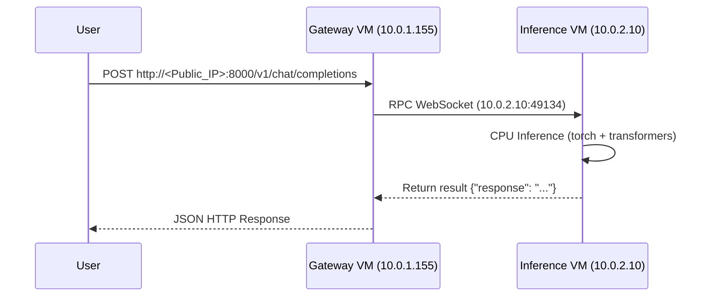

# Distributed Multi-VM Inference System on AWS

This project deploys a distributed, secure inference mesh on AWS using the `iii` quickstart project. The system is split across multiple virtual machines inside an isolated private subnet and exposes model inference through a public-facing JSON HTTP API.

---

## Architecture

The system is deployed across two EC2 instances inside a custom VPC.

```text
Internet
    ↓
Internet Gateway
    ↓
Public subnet
    └── API Gateway VM (caller-gateway)
           ├── iii-http (8000)
           └── caller-worker (TypeScript)
                 ↓
           (NAT Gateway)
                 ↓
Private subnet
    └── Inference VM (inference-worker)
           └── inference-worker (Python + transformers)
```

### High-Level Flow

1. Client sends request to `/v1/chat/completions` on the API Gateway.
2. The Gateway VM receives the request through the `iii-http` trigger on port `8000`.
3. The TypeScript `caller-worker` dispatches the request to the `inference::run_inference` function over RPC.
4. The Python `inference-worker` running in the private subnet executes the GGUF model generation on CPU.
5. The result is returned back to the API layer and served to the client as JSON.



---

## Infrastructure

The infrastructure is provisioned completely using Terraform.

### Components

* **Custom VPC** with internet gateway and routing.
* **Public subnet** hosting the API Gateway.
* **Private subnet** hosting the Inference Worker VM in complete isolation.
* **NAT Gateway** allowing the private Inference VM to securely pull repository updates and download model weights.
* **Security Groups** restricting public access to port `8000` on the gateway and allowing only private VPC communication on port `49134` (RPC hub).

### VM Design

#### API Gateway VM (Public Subnet)
* Runs the central `iii-engine` hub listening on `0.0.0.0:49134`.
* Hosts the HTTP API Gateway trigger on `0.0.0.0:8000`.
* Runs the TypeScript `caller-worker` using `bun`.

#### Inference VM (Private Subnet)
* Runs the Python `inference-worker` loaded with a quantized Gemma 3 270M GGUF model.
* Connects to the Gateway's hub via private networking (`10.0.2.10` -> `10.0.1.155`).
* Has no public IP or public ingress rules.

---

## Networking Design

### Security Model

Only the API Gateway VM is publicly accessible.

#### API VM (caller-gateway)
* Allowed: SSH (`22`), HTTP API (`8000`).

#### Inference VM (inference-worker)
* Allowed: RPC port (`49134`) only from the API VM security group.
* The inference machine is located in the private subnet and is not exposed to the public internet.

---

## Infrastructure as Code

Terraform configuration is located in the `terraform/` directory.

### Terraform Structure

```text
terraform/
├── provider.tf
├── main.tf
├── variables.tf
├── outputs.tf
```

### Run Terraform

Initialize:
```bash
terraform init
```

Validate:
```bash
terraform validate
```

Provision:
```bash
terraform apply
```

Outputs:
```text
gateway_public_ip = 13.201.127.202
```

---

## Deployment Configuration

Systemd unit files are handled via user-data templates during deployment:

```bash
# Gateway Services
sudo systemctl enable iii-engine
sudo systemctl enable caller-worker
sudo systemctl start iii-engine
sudo systemctl start caller-worker

# Inference Services
sudo systemctl enable inference-worker
sudo systemctl start inference-worker
```

---

## Deployment Steps

### 1. API VM Setup
During deployment, the script installs the dependencies and starts the Go engine and the TS worker:
```bash
curl -fsSL https://bun.sh/install | bash
curl -fsSL https://install.iii.dev/iii/main/install.sh | sh
bun install
```

### 2. Inference VM Setup
The inference script sets up Python, `uv`, and swap space before building dependencies and starting the worker:
```bash
curl -LsSf https://astral.sh/uv/install.sh | sh
uv sync
```

---

## API Endpoint

### POST `/v1/chat/completions`

```bash
curl -X POST http://13.201.127.202:8000/v1/chat/completions \
-H "Content-Type: application/json" \
-d '{
  "messages": [
    {
      "role": "user",
      "content": "Explain quantum entanglement in 10 words."
    }
  ]
}'
```

---

## Challenges Faced & Debugging

### 1. SSH & Networking Issues
* **Problem:** Host key validation and connectivity errors occurred when provisioning security rules.
* **Fix:** Configured explicit inbound rules in `terraform/main.tf` to authorize port `22` and established clean route tables connecting the NAT gateway to the private subnet route table.

### 2. Service Co-location Conflicts (404/Function Not Found)
* **Problem:** By default, the `iii` engine tried to spin up local workers defined in `config.yaml`, creating co-location conflicts and route mismatches.
* **Fix:** Introduced a dedicated production configuration file `config.prod.yaml` that disabled managed workers. The Go engine and TS worker were split into independent systemd units, allowing them to run cleanly as separate system services.

### 3. Disk Space Limits during uv Sync
* **Problem:** Downloading heavy machine learning packages (`torch`, `transformers`) failed on boot with a `No space left on device` error.
* **Fix:** Increased the EBS root block device size from 8 GB to 30 GB gp3 in `terraform/main.tf` for both VMs.

### 4. Memory Constraints & Out-of-Memory (OOM) Crashes
* **Problem:** Model loading by PyTorch on startup exceeded the physical 1 GB RAM of the `t3.micro` instance, causing the systemd service to get terminated by the Linux OOM killer.
* **Fix:** Increased the system virtual memory swap space allocation on the inference instance from 1 GB to 4 GB, allowing the Gemma-3 weights to load into memory safely.

### 5. Python Output Logging Buffering
* **Problem:** `journalctl` failed to output any diagnostic info from the Python process until shutdown, making runtime debugging impossible.
* **Fix:** Injected `PYTHONUNBUFFERED=1` as an environment variable in the systemd service unit to flush stdouts immediately.

### 6. CPU Thread Thrashing on Constrained Hardware
* **Problem:** PyTorch defaults to using many OpenMP/MKL threads, which causes massive context-switching overhead on a 2-vCPU instance and severely stalls generation.
* **Fix:** Added `torch.set_num_threads(1)` at the start of `main.py` to ensure execution runs on a single core, dramatically speeding up execution.

### 7. SDK client and HTTP Timeouts
* **Problem:** CPU token generation takes longer than 30 seconds, causing the HTTP gateway and the TS SDK `trigger()` client to throw timeout errors.
* **Fix:** Increased the client SDK timeout option (`invocationTimeoutMs: 90000`) and the HTTP Gateway default timeout in `config.prod.yaml` to 90 seconds. Also optimized generation by setting `max_new_tokens=128`.

---

## Tradeoffs

Due to running on AWS Free Tier CPU instances (`t3.micro`), token generation is slower than GPU environments. The architecture is configured to balance resource utilization and safety:
* **Latency vs Cost:** CPU inference keeps the setup inside the AWS Free Tier, using swap space to run a model that exceeds physical RAM.
* **Timeout vs Safety:** Limiting `max_new_tokens` to `128` prevents runaway loops on CPU while returning results within the gateway's timeout bounds.

---

## Technologies Used

* AWS EC2, VPC, NAT Gateway, Security Groups
* Terraform (IaC)
* Bun & TypeScript (Gateway worker)
* Python 3.14, uv, PyTorch & Transformers (Inference worker)
* `iii` Engine (RPC and HTTP orchestration)
* Gemma 3 270M GGUF model

---

## Production Hardening & Scaling Considerations

### What I would harden before production

1. **Security & Least Privilege:**
   * Restrict SSH access entirely by using AWS Systems Manager (SSM) Session Manager instead of exposing port 22.
   * Store and inject secrets (like `HF_TOKEN`) using AWS Secrets Manager rather than hardcoding.
2. **Observability:**
   * Forward systemd logs to AWS CloudWatch or Grafana Loki.
   * Integrate Prometheus/Grafana to monitor GPU/CPU usage, memory limits, and request latency.
3. **Containerization & Orchestration:**
   * Package workers into Docker containers and orchestrate using AWS ECS or EKS. This guarantees environment reproducibility and makes horizontal scaling trivial.
4. **Reliability:**
   * Add active health checks and configure an autoscaling group with a load balancer for the API Gateway VM.

### What I would do differently if the model were 100x larger

If the model size scaled by 100x (e.g. 27B+ parameter models):
1. **GPU-Backed Compute:** Swap CPU instances for GPU-backed EC2 instances (e.g. `g5.xlarge` or `p4d` instances) since CPU inference would be too slow to be useful.
2. **Optimized Inference Runtimes:** Replace PyTorch raw CPU inference with specialized serving engines like `vLLM` or `TensorRT-LLM` to utilize continuous batching and PagedAttention.
3. **Model Parallelism:** Shard the model weights across multiple GPUs (Tensor/Pipeline Parallelism) using frameworks like Megatron-LM or DeepSpeed.
4. **Asynchronous Request Flow:** Instead of blocking HTTP connections, shift the API to an async model (returning a task ID) or stream output tokens in real-time to the client using Server-Sent Events (SSE).
