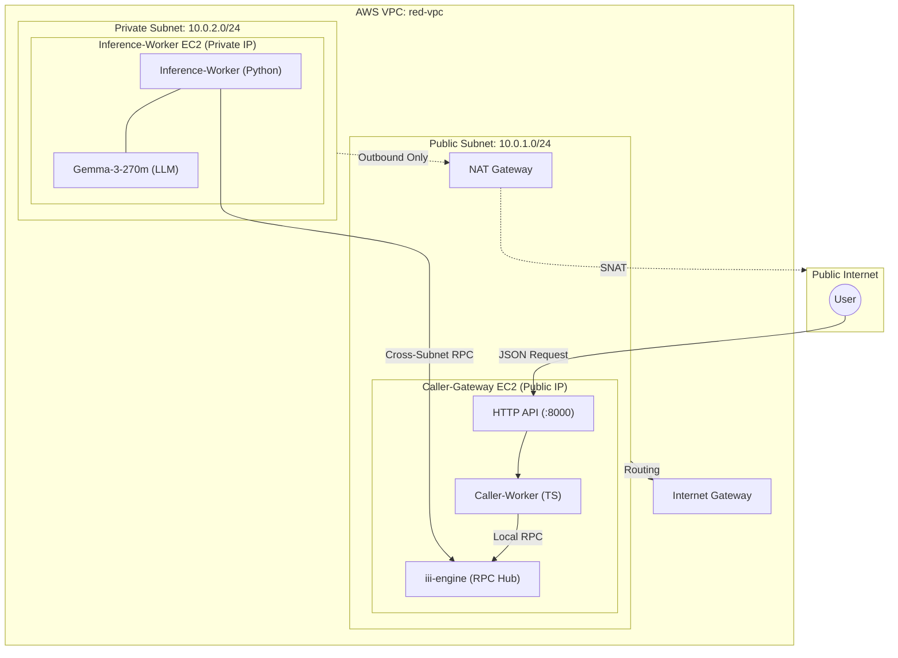

# Alchemyst DevOps Internship Assignment

Deploy the
[Alchemyst `quickstart`](https://github.com/Alchemyst-ai/hiring/tree/main/may-2026/devops/quickstart)
inference mesh across isolated VMs in a private subnet, then expose it behind a
JSON HTTP API.

## Architecture



### Prerequisites

#### Manual installation

<details>
<summary>Click to expand manual steps</summary>

1. **AWS CLI** — Install the
   [`aws` CLI](https://docs.aws.amazon.com/cli/latest/userguide/getting-started-install.html),
   then authenticate:
   ```bash
   aws configure
   ```

2. **Terraform** — Install
   [Terraform](https://developer.hashicorp.com/terraform/install) ≥ 1.5:
   ```bash
   terraform --version
   ```

3. **Python 3.14** + **uv** — Install [uv](https://docs.astral.sh/uv/):
   ```bash
   curl -LsSf https://astral.sh/uv/install.sh | sh
   uv python install 3.14
   ```

4. **Node.js 23+**, **TypeScript**, **Bun** — Install via your package manager
   or [nvm](https://github.com/nvm-sh/nvm):
   ```bash
   nvm install 23
   npm install -g typescript
   curl -fsSL https://bun.sh/install | bash
   ```

5. **curl**, **jq** — Install via your system package manager:
   ```bash
   # Debian/Ubuntu
   sudo apt install curl jq
   # macOS
   brew install curl jq
   ```

</details>

#### Using Nix (Alternative)

If you have [Nix](https://nixos.org/download) installed with flakes enabled, you
can skip the manual steps and run:

```bash
nix develop
```

This drops you into a **Linux FHS environment** with most dependencies
available:

- AWS CLI (`aws`)
- Terraform + Terraform LS
- Python 3.14 + uv
- Node.js 24, TypeScript, Bun
- curl, jq

Inside the Nix shell, install the `iii` CLI using the official script:

```bash
curl -fsSL https://install.iii.dev/iii/main/install.sh | sh
```

#### Agent Skill

If you are using any agent harness, you can install the `iii` skill for
specialized assistance:

```bash
npx skills add iii-hq/iii/skills
```

## Deployment

To deploy the infrastructure, follow these steps:

1. **Configure AWS Credentials:**
   ```bash
   aws configure
   ```

2. **Initialize and Apply Terraform:**
   ```bash
   cd terraform
   terraform init

   # Recommended method (uses credentials from aws configure)
   terraform apply \
     -var="repo_url=https://github.com/YOUR_USERNAME/YOUR_REPO.git" \
     -var="my_ip=$(curl -s ifconfig.me)/32"

   # Alternative "fail-proof" method (if aws configure fails)
   # AWS_ACCESS_KEY_ID="AKIA..." AWS_SECRET_ACCESS_KEY="wJalr..." terraform apply ...
   ```

> **Note:** The `repo_url` variable is critical. The EC2 instances will clone
> this repository on boot to set up the workers. Ensure your latest changes are
> pushed to your remote repository before applying Terraform.

The EC2 user-data scripts will automatically:

- Provision the VPC, Subnets, and NAT Gateway.
- Set up the Caller/Gateway EC2 with a public IP.
- Set up the Inference EC2 with only a private IP.
- Install all necessary runtimes (Bun, Python 3.14, uv).
- Start the `iii` engine hub and the workers as systemd services.

## API Usage

Once deployed, you can hit the gateway endpoint. Replace `<GATEWAY_IP>` with the
public IP of the `caller` instance.

### Sample Request

```bash
curl -X POST http://<GATEWAY_IP>:8000/v1/chat/completions \
  -H "Content-Type: application/json" \
  -d '{
    "messages": [
      {"role": "user", "content": "Explain blue balls"."}
    ]
  }'
```

### Sample Response

```json
{
  "result": {
    "response": "Quantum entanglement is a phenomenon where two or more particles become connected in such a way that the state of one particle instantly influences the state of the others, regardless of the distance between them.",
    "success": "Connected two workers and they're interoperating seamlessly "
  }
}
```

## Writeup

### Production Hardening

Before moving this to a production environment, several steps should be taken:

1. **Security:** Implement TLS for the public HTTP endpoint. Currently, it's
   served over plain HTTP. Additionally, adding an authentication layer (e.g.,
   API keys or OAuth2) is crucial.
2. **Observability:** While `iii` has built-in observability, I would integrate
   with Cloud Monitoring and Logging (Stackdriver) for better alerting and
   long-term log retention.
3. **Availability:** Move the gateway behind a Global Load Balancer and use
   Managed Instance Groups (MIGs) for both the gateway and inference workers to
   allow for auto-healing and scaling.
4. **Networking:** Further restrict firewall rules. While the internal traffic
   is limited to the VPC, using Service Accounts for identity-based firewalling
   (GCP IAM) would be more robust than just IP-based rules.

### Scaling to 100x Larger Model

If the model were 100x larger (e.g., a 70B+ parameter model):

1. **GPU Acceleration:** Standard CPU instances would be far too slow. We would
   need A100 or H100 GPUs.
2. **Distributed Inference:** A single VM wouldn't have enough VRAM. We would
   employ Tensor Parallelism (TP) or Pipeline Parallelism (PP) using frameworks
   like vLLM or NVIDIA Triton to split the model across multiple GPUs or even
   multiple nodes.
3. **Model Storage:** The model would be hundreds of gigabytes. We would use a
   high-performance shared file system or pre-load the model into persistent
   disks to avoid long startup times.
4. **Quantization:** Even with GPUs, we would likely use 4-bit or 8-bit
   quantization (AWQ/GPTQ) to fit the model in memory and improve throughput.
