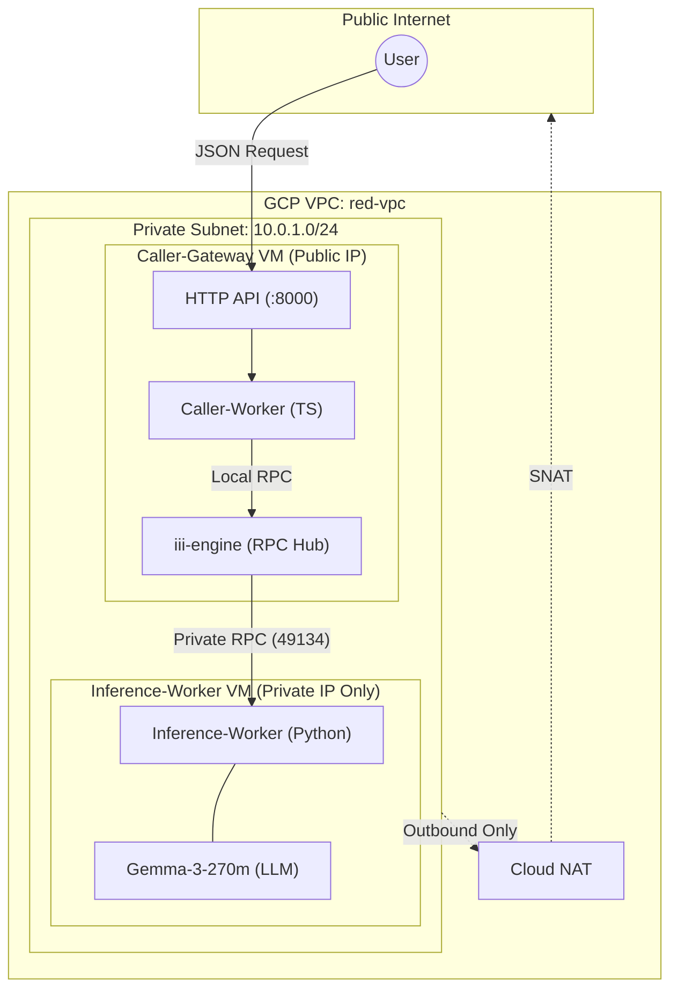

# Alchemyst DevOps Internship Assignment

Deploy the
[Alchemyst `quickstart`](https://github.com/Alchemyst-ai/hiring/tree/main/may-2026/devops/quickstart)
inference mesh across isolated VMs in a private subnet, then expose it behind a
JSON HTTP API.

## Architecture



### Prerequisites

#### Using Nix (recommended)

Install [Nix](https://nixos.org/download) with flakes enabled, then run:

```bash
nix develop
```

This drops you into a shell with all dependencies available:
- Google Cloud SDK (`gcloud`)
- Terraform + Terraform LS
- Python 3.14 + uv
- Node.js 24, TypeScript, Bun
- curl, jq

#### Manual installation

<details>
<summary>Click to expand manual steps</summary>

1. **Google Cloud SDK** — Install the [`gcloud` CLI](https://cloud.google.com/sdk/docs/install), then authenticate:
   ```bash
   gcloud auth application-default login
   ```

2. **Terraform** — Install [Terraform](https://developer.hashicorp.com/terraform/install) ≥ 1.5:
   ```bash
   terraform --version
   ```

3. **Python 3.14** + **uv** — Install [uv](https://docs.astral.sh/uv/):
   ```bash
   curl -LsSf https://astral.sh/uv/install.sh | sh
   uv python install 3.14
   ```

4. **Node.js 23+**, **TypeScript**, **Bun** — Install via your package manager or [nvm](https://github.com/nvm-sh/nvm):
   ```bash
   nvm install 23
   npm install -g typescript
   curl -fsSL https://bun.sh/install | bash
   ```

5. **curl**, **jq** — Install via your system package manager:
   ```bash
   # Debian/Ubuntu
   sudo apt install curl jq
   # macOS
   brew install curl jq
   ```

</details>
